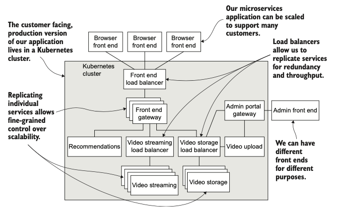
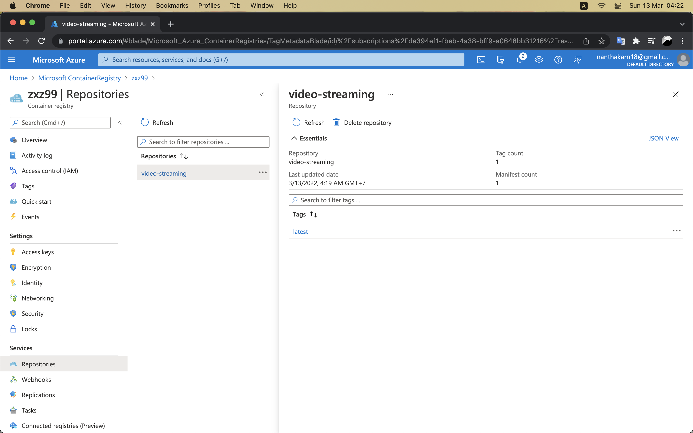

# Video Streaming Microservice

This project is a tutorial to build microservices based on the [textbook](https://www.manning.com/books/bootstrapping-microservices-with-docker-kubernetes-and-terraform?a_aid=datawranglingwithjavascript&a_bid=f8e47dba) --Bootstrapping Microservices with Docker, Kubernetes and Terraform.

## About the Application

- name: `FlixTube`
- have a browser-based front end
- contain services for:
  - video streaming
  - storage and upload
  - a gateway for the customer-facing front end

## Tools

- `Node.js`: To build the microservices
- `Docker`: To package and deploy the services
- `Docker Compose`: To test the microservices application on the development workstation
- `Kubernetes`: To host the application in the cloud
- `Terraform`: To build the cloud infrastructure, the Kubernetes cluster, and deploy the application
- `Azure Storage`: To store files in the cloud
- `MongoDB`: is a popular NoSQL database

## Architecture



## Development (step-by-step hand-on)

Source codes: [bootstrapping-microservices/repos](https://github.com/orgs/bootstrapping-microservices/repositories)

### Chapter 2 Creating your first microservice

Building an HTTP server for video streaming

1. Create a Node.js project for our microservice.
2. Install Express and create a simple HTTP server.
3. Add an HTTP GET route /video that retrieves the streaming video.

Setup project

```bash
mkdir video-streaming
cd video-streaming

npm init -y
npm install --save express
npm install
```

Create router --[index.js](video-streaming/src/index.js)

```js
const express = require("express");

const app = express();
const port = 3000;

app.get("/", (req, res) => {
  res.send("Hello World!");
});

app.listen(port, () => {
  console.log(
    `First example app listening on port ${port}, point your browser at http://localhost:3000`
  );
});
```

> **Running**: to test/run the server, in video-streaming terminal run `node index.js` and go to http://localhost:3000

Update HTTP endpoint, In [index.js](video-streaming/src/index.js)

```js
// add
const fs = require("fs");

// update
app.get("/video", (req, res) => {
  const path = "../videos/SampleVideo_1280x720_1mb.mp4";
  fs.stat(path, (err, stats) => {
    if (err) {
      console.error("An error occurred ");
      res.sendStatus(500);
      return;
    }

    res.writeHead(200, {
      "Content-Length": stats.size,
      "Content-Type": "video/mp4",
    });
    fs.createReadStream(path).pipe(res);
  });
});
```

> **Running**: go to http://localhost:3000/video

Config environment

- setup env variable, in terminal

  ```bash
  export <key>=<value>
  ```

- in [index.js](video-streaming/src/index.js) using `process.env.<key>`

Setup production

- in terminal

  ```bash
  npm install --only=production
  ```

- in [package.json](video-streaming/package.json)

  ```json
  "scripts": {
      "test": "echo \"Error: no test specified\" && exit 1",
      // add
      "start": "node index.js"
  },
  ```

> **Running**: from now, using `npm start` convention

Create live reload pipeline

```bash
npm install --save-dev nodemon
```

> **Running**: to use nodemon, using `npx nodemon index.js`

> or add "start:dev": "nodemon index.js" in [package.json](video-streaming/package.json) scripts (just like above) to use `npm run start:dev` convention instead

Summary of Running Command

```bash
# install dependencies
npm install
# install as simulated production
npm install --only=production

# run
npm start
# run with live reload
npm run start:dev
```

### Chapter 3 Publishing your first microservice

Deploy the video streaming microservice to Docker registry

1. Package our microservice into a Docker image
2. Publish our image to our private container registry
3. Run our microservice in a container

Update directory structure

- create /src, move index.js in
- update [index.js](video-streaming/src/index.js)
- update [package.json](video-streaming/package.json)
- create /videos, move video in

Create [Dockerfile](video-streaming/Dockerfile)

```Dockerfile
FROM node:12.18.1-alpine

WORKDIR /usr/src/app
COPY package*.json ./

RUN npm install --only=production
COPY ./src ./src
COPY ./videos ./videos

CMD npm start
```

Create image

launch docker, then in terminal

```bash
# docker build -t <your-name-for-the-image> --file <path-to-your-Dockerfile> <path-to-project>
docker build -t video-streaming --file Dockerfile .
```

Create/Run container from our image

```bash
# docker run -d p <host-port>:<container-port> <image-name>
docker run -d -p 3000:3000 video-streaming
```

> **Checking**: run `docker container list` to check whether the container running or not, and run `docker logs <container_id>` to check the running server.

Publishing the image

- create account on `Microsoft Azure` (only first time)
- create container registry
  - in Microsoft Azure find [container registry service](https://portal.azure.com/#blade/HubsExtension/BrowseResource/resourceType/Microsoft.ContainerRegistry%2Fregistries)
  - create a registry (basic, name=zxz99)
  - go to Access keys, and Enabled Admin user
- login docker (not docker account)

  ```bash
  # docker login <your-registry-url> --username <your-username> --password <your-password>
  docker login zxz99.azurecr.io --username zxz99 --password <password_from_zxz99_access_keys>
  ```

- add tag to the image

  ```bash
  # docker tag <existing-image> <registry-url>/<image-name>:<version>
  docker tag video-streaming zxz99.azurecr.io/video-streaming:latest
  ```

- publish image to the registry

  ```bash
  # docker push <registry-url>/<image-name>:<version>
  docker push zxz99.azurecr.io/video-streaming:latest
  ```

- check Repositories (Microsoft Azure), you will see the image published with tag



> **Cleaning**: you can go ahead and delete all images from your local pc

> **Running**: everyone can run `docker run -d -p 3000:3000 zxz99.azurecr.io/video-streaming:latest` to create/run container from your published image

### Chapter 4 Data management for microservices

Adding both file storage and a database to our FlixTube example application (Adding database server and a second microservice to our application)

Create docker compose file

in [docker-compose.yml](docker-compose.yml)

```yml
version: "3"
services:
  video-streaming:
    image: video-streaming
    build:
      context: ./video-streaming
      dockerfile: Dockerfile
    container_name: video-streaming
    ports:
      - "4000:80"
    environment:
      - PORT=80
    restart: "no"
```

Build/Run docker compose, in terminal

```bash
docker-compose up --build
```

> **Checking**: to watch the video, checkout http://localhost:4000/video

for other commands

```bash
# shows list of docker-compose
docker-compose ps
# stop (not remove) container
docker-compose down
# do both to update code or dependencies
docker-compose down && docker-compose up --build
```

Docker Compose for production (short term)

- Create a virtual machine (VM) in the cloud and install Docker and Docker Compose. Then copy your application to the VM and boot it using Docker Compose. (con: limit horizontally scalability)

- Use the Docker Swarm hosted service (from the makers of Docker) to deploy your application defined by the Docker Compose file. (con: expensive --need paid package)

So, let use `Kubernetes`!

Create file storage

You can use `AWS S3` or `Google Cloud Storage`. But in this tutorial, we will use `Azure Storage`

- create azure storage
  - in Microsoft Azure find [storage account](https://portal.azure.com/#blade/HubsExtension/BrowseResource/resourceType/Microsoft.Storage%2FStorageAccounts)
  - create a storage account (standard, name=storagezxz, redundancy=GRS)
  - go to Access keys, and copy key1
- Upload video to the storage
  - go to Container (in azure storage account)
  - create a container (name=videos, access=blobs)
  - in that container, click upload...


Create a microservice to read the storage

- setup project

  ```bash
  # create new folder (microservice)
  mkdir azure-storage
  cd azure-storage

  # install packages
  npm init -y
  npm install --save express
  npm install --save azure-storage
  npm install
  ```

- add [code](azure-storage/src/index.js)
- add [Dockerfile](azure-storage/Dockerfile)

Config environment

```bash
export PORT=3000
export STORAGE_ACCOUNT_NAME=storagezxz
export STORAGE_ACCESS_KEY=<access-key1>
```

Update environment in [docker-compose.yml](docker-compose.yml)

> **Running/Testing**: (after add line 8-9 in package.json) run `npm start` or `npm run start:dev` and go to http://localhost:3000/video?path=SampleVideo_1280x720_1mb.mp4
